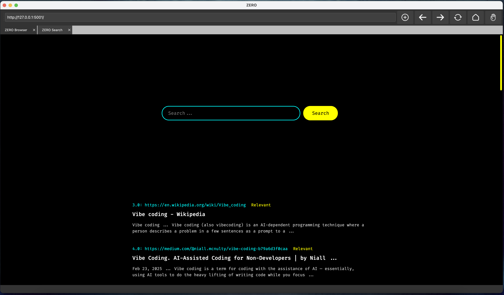

# ZERO Browser and Search Engine

ZERO browser provides a featureless browsing experience. ZERO search engine offers a minimal web search experience.

## Description

Zero money? Zero friends? Zero security? It's your lucky day. **ZERO** is here. A web browser with zero features. It all starts from **ZERO**.

## Google Cloud Platform Setup

Create a _Google Programmable Search Engine_ and get an API key. If you don't have a Google Cloud Account, you have to create one.

- Setup a programmable search engine [Custom Search API](https://developers.google.com/custom-search/v1/introduction)
  - You can create one [here](https://programmablesearchengine.google.com/controlpanel/all)
- Create an [API key](https://console.cloud.google.com/apis/credentials) for the engine
- Add a billing account (100 request/day are free for a programmable search engine).

## Local Python setup

Install the Python dependencies:

`% pip install -r requirements.txt`

## Install and run the ZERO search engine

Go to the `zero-search-engine` folder

`% cd zero-search-engine`

Open the `settings.py` file and add the Google Custom Search API Key (SEARCH_KEY) and Google Custom Search Engine ID (SEARCH_ID). You can also create a file `private.py` and add the secrets there.

Run the search engine (as a development project):

`% flask --debug run --port 5001`

## Install and run the ZERO browser1,2,3

Make sure that the search engine is running in the background.
Go to the `zero-browser` folder:

`% cd zero-browser`

Start the ZERO browser application:

`% python browser.py`

## UI

A walkthrough of the app is available [here](https://youtu.be/WEzMakYqqqk).

## Future improvements

Further improvements in the functionality of the ZERO browser maybe added in the future as well as bug fixes. The same applies to the ZERO search engine.

## Acknowledgments

The ZERO search engine is based heavily on the search engine created by VikParuchuri4,5.

## License

MIT License

1[QtWebEngine](https://doc.qt.io/qt-6/qtwebengine-index.html)
2[PyQt](https://www.riverbankcomputing.com/)
3[PyQtWebEngine](https://pypi.org/project/PyQtWebEngine/)
4[GitHub: dataquestio/project-walkthroughs/search](https://github.com/dataquestio/project-walkthroughs/tree/master/search)
5[Build A Custom Search Engine In Python With Filtering
](https://www.youtube.com/watch?v=WYPFotzHZ4A)
